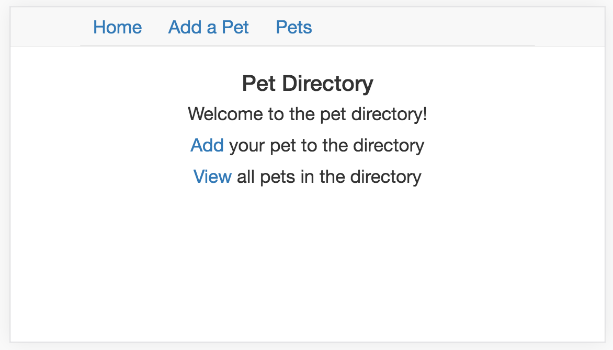
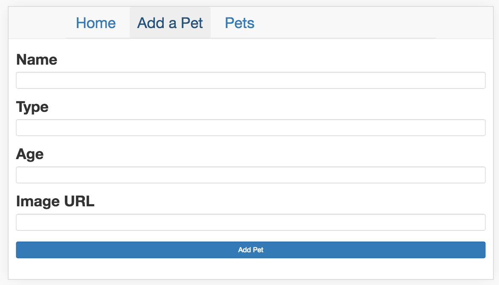

Usage
=====
A directory of pet information and photos.
* The home page directs users toward adding new pets and viewing existing ones:

* Add a new pet by supplying it's name, age, type, and a public url of a photo:

* View pets to see sortable, filterable tiles of pet info and pictures:

Technologies
============
MEAN stack:
* Angular.js
* Express.js
* Node.js
* Mongodb/mongoose

Direction
=========
##Welcome to your LAST weekend challenge!

In this challenge, you will be creating a Pet Application that allows a user to create Pets records that are stored in a database. The list will be displayed on the DOM.

You will need the following:

At the top of the page should be a greeting with some direction on how to use the application,
Next, should be a inputs where the user can add a new pet with a form,
Below all of that should be a list of the entered pets.
You will use the full MEAN stack for this (Mongo, Express, Angular, Node)

Each Pet will need to have the following information:

* Name (example, Grilled Cheese)
* Animal (example, Cat),
* Age (example, 14)
* Image Url
* Everyone, post info and image URL links to your pets in the #tau slack channel by saturday morning. I'll then put them on my server and provide urls that we can use.

##Jedi Knight Mode
Look into delete functionality. Add a button in the Pets List to delete a pet from the database. This will require research in how to identify the pet that is supposed to be deleted from the database.

##Jedi Master Mode
Use Angular Routes to have a view for each function:

Home view (description/landing)
Add
All Pets
##Jedi Council Member Mode
Look into Filtering. In the Pets view, include a button to turn on Alphabetical Sorting of the pets that can be toggled on and off.
